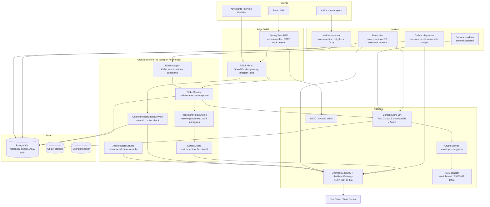

# 3. Architecture

## 3.1 Shaping forces

Four constraints drive nearly every structural decision:

0. **Two Jira deployments, on-premises data.** Per [D1 and D2](decisions.md), Cloud and Data
   Center are both first-class from the MVP, and content and keys never leave customer
   infrastructure. This makes `JiraDeployment`, `RichTextCodec` and the storage/KMS abstractions
   foundational rather than future-proofing.
1. **No distributed transactions.** Kafka, Jira, the metadata database and the object store
   cannot commit together. The design uses a single transactional resource (PostgreSQL) plus a
   transactional outbox, and makes every external effect idempotent or reconcilable.
2. **Content must not leak.** Leak prevention is not a code-review rule; it is a structural
   one. Exactly one component may speak to Jira, and it accepts only a type that the policy
   engine produces.
3. **One behaviour, three entry points.** UI, REST and Kafka must produce identical results.
   They are therefore all thin adapters over one application core.
4. **Jira is a rate-limited, partially-consistent, occasionally-unavailable dependency.** Every
   Jira interaction is queued, budgeted, retried and reconcilable.

## 3.2 Component overview

## 3.3 Component responsibilities

### 3.3.1 BFF and REST API

The React SPA never holds a token. The BFF terminates the OIDC session, stores tokens
server-side, sets an `HttpOnly; Secure; SameSite=Lax` session cookie, and enforces CSRF on
state-changing requests. The same Spring application exposes `/api/v1` for external clients
authenticated by bearer tokens from the enterprise IdP.

Both transports funnel into the same application services. Adapters are responsible only for
transport concerns: deserialisation, idempotency-key handling, pagination cursors, and
translating domain results into HTTP.

### 3.3.2 PlacementPolicyEngine

Pure, side-effect-free. Input: a `TicketCommand` (a set of intended part values), the resolved
project/issue type, and the active policy set. Output: a `PlacementPlan` — for each part, the
placement, the storage route, the encryption requirement, the Jira surrogate, and the link
placement. Being pure makes precedence exhaustively testable (FR-CP-2).

### 3.3.3 EgressGuard and JiraWriteGateway — the leak boundary

The only type `JiraWriteGateway` accepts is `JiraSafePayload`. Its constructor is package-private
and it can only be produced by `EgressGuard.sanitise(PlacementPlan, ...)`. `EgressGuard`:

1. Asserts every part in the payload has placement `JIRA` or is a surrogate.
2. Recomputes the normalised hash of every string in the payload and compares against the hashes
   of `EXTERNAL` parts of the same ticket — a match aborts the operation.
3. Runs configured content classifiers (regex/DLP patterns) on the payload when the policy
   declares a classification above the configured threshold.
4. On any failure, fails **closed**: the Jira write does not happen, the operation errors, and a
   high-severity audit event is written containing identifiers only.

An ArchUnit rule asserts that no class outside the gateway package references the Jira HTTP
client, and a second rule forbids `toString()`/Lombok `@ToString` on content-bearing types.

### 3.3.4 Outbox dispatcher

Every Jira mutation is written as an outbox row in the *same* transaction as the domain change.
A dispatcher claims rows with `SELECT ... FOR UPDATE SKIP LOCKED`, groups them by target issue,
and executes them through a **per-issue single-threaded lane** so that Jira's 20-writes-per-2-
seconds per-issue limit (§0.3) is never breached by our own concurrency. A global token bucket
sits above that for the burst and hourly point budgets.

Each outbox row carries an `effectKey` that makes replay safe: remote-link writes deduplicate on
`globalId`; property writes are `PUT` (idempotent); comment and attachment creation carry an
`effectKey` recorded on success so a replay is skipped; issue creation is handled by the
ambiguity protocol in [12.4](12-reliability.md).

### 3.3.5 ContentStore SPI and CryptoService

See [8. Storage](08-storage.md) and [9. Encryption](09-encryption.md). The important structural
point: encryption sits *between* the application and the store, so every backend gets identical
confidentiality guarantees regardless of whether it offers server-side encryption.

### 3.3.6 Kafka consumer

A state machine persisted in PostgreSQL, not in Kafka. See [7. Kafka](07-kafka.md).

### 3.3.7 Reconciler

A scheduled worker that: extends dynamic webhook registrations before the 30-day expiry; sweeps
Jira for changes since the last watermark; resolves `AMBIGUOUS` ticket creations; garbage-collects
orphaned objects and orphaned metadata; re-wraps data keys after KEK rotation; and expires
soft-deleted content past its retention.

### 3.3.8 Preview renderer

A separate deployment with no egress network policy and no credentials other than a narrowly
scoped decrypt permission. It receives a content reference over an internal API, decrypts to
memory, renders to an image or sanitised HTML, and returns it. Renderers for untrusted file
formats are the classic RCE surface, so isolation is structural rather than a hardening option.

## 3.4 Technology stack

Java backend and React frontend are fixed by you; the choices below are within that.

### 3.4.1 Backend

| Choice | Why | Alternative considered |
|---|---|---|
| **Java 21 (LTS)** | Virtual threads make the I/O-bound fan-out (Jira + storage + KMS per request) cheap without reactive code. Pattern matching and records suit the policy/plan model. | Java 17 — no virtual threads; the fan-out then needs either thread-pool tuning or WebFlux. |
| **Spring Boot 3.3+** | Spring Security is the only mature Java stack that covers OIDC login, resource server, *and* OAuth2 client with token persistence — we need all three, and the Jira connection is naturally modelled as an `OAuth2AuthorizedClient` with a custom repository. | Quarkus — excellent, but Spring Security's OAuth2 client breadth is the deciding factor here. |
| **PostgreSQL 16** | One transactional resource for metadata, outbox, ACL and audit. `SKIP LOCKED` for the outbox, advisory locks for single-flight refresh and per-issue mutexes, `jsonb` for policy and mapping documents, partitioning for audit. | Adding Redis in the MVP — rejected: a second datastore for caches and locks is not worth the operational cost until measured. |
| **Flyway** | Deterministic, reviewable migrations. | Liquibase — fine; Flyway's SQL-first style suits a schema this explicit. |
| **Spring Kafka** | Container-managed consumers, manual ack, and the non-blocking retry-topic pattern we need. | Raw client — more control, more code. |
| **NIO / Apache Chemistry OpenCMIS / AWS SDK v2 / Azure SDK** | The four backends. Per [D2](decisions.md), filesystem and CMIS are the MVP primaries and the S3 adapter ships with them, pointed at on-premises S3-compatible storage (MinIO, Ceph RGW, StorageGRID, ECS). OpenCMIS is the only maintained Java CMIS client. | — |
| **HashiCorp Vault Transit** (primary KMS), **PKCS#11** (HSM custody) | Per [D2](decisions.md), keys stay on-premises. Vault Transit gives envelope encryption, rotation and rewrap through a clean API and can itself be sealed by an HSM — managed-KMS ergonomics without leaving the datacentre. PKCS#11 covers deployments that mandate hardware custody. | Cloud KMS — excluded by D2 |
| **AWS Encryption SDK for Java** *or* **Google Tink** | Framed, authenticated streaming encryption with AAD and key commitment, already audited. Hand-rolling AES-GCM framing is the single most dangerous thing we could do in this project. | Plain JCE — rejected, see [9.3](09-encryption.md). |
| **Hand-written Jira client over Spring `RestClient`** | Atlassian's Java REST client is Data-Center-oriented and effectively unmaintained for Cloud. DTOs generated from Atlassian's published OpenAPI, with a thin resilience layer. | `jira-rest-java-client` — rejected as stale. |
| **springdoc-openapi** | Generates OpenAPI 3.1 from the running code so spec drift is a CI failure, not a discovery. | Spec-first with generated stubs — viable; we use spec-*checked* instead. |
| **Resilience4j** | Circuit breaker, bulkhead, rate limiter per Jira deployment. | — |
| **Micrometer + OpenTelemetry** | Traces spanning HTTP → outbox → Jira, correlated with Kafka correlation ids. Span attributes go through an allow-list filter (FR-CP-6). | — |
| **Testcontainers, WireMock, ArchUnit, jqwik** | Postgres/Kafka/MinIO/Azurite containers; a Jira simulator with fault injection; structural rules; property-based tests for the authorization algebra. | — |

### 3.4.2 Frontend

| Choice | Why |
|---|---|
| **React 18 + TypeScript + Vite** | Given. TypeScript is non-negotiable for a dynamic form engine driven by `createmeta` schemas. |
| **TanStack Query** | Server-state caching with the invalidation discipline the metadata cache needs. |
| **React Hook Form + Zod** | The form schema is *built at runtime* from `createmeta`; Zod schemas can be constructed dynamically and reused for the field-level error mapping. |
| **Atlassian Design System (`@atlaskit`)** | Users compare this UI to Jira directly. Matching components reduces the perceived parity gap for free. |
| **TipTap + ProseMirror**, with a jvault ADF serializer | **Decided by measurement** (docs/15-implementation-plan.md). `@atlaskit/editor-core` ships 4.42 MB of gzipped JavaScript against TipTap's 0.16 MB, fails a default Vite production build, pins React to 18, and drags in Confluence embedding and Atlassian profile-card code this application will never show. ProseMirror's document model is a tree and so is ADF, so the serializer is a structural mapping rather than a parser. |

### 3.4.3 Platform

Containers on Kubernetes. Four deployments — `api` (BFF + REST), `worker` (outbox +
reconciler), `consumer` (Kafka), `preview` (isolated) — because they have different scaling
signals, different blast radii, and in the preview case a different network policy. Secrets from
the platform secret manager (External Secrets / CSI driver), never from environment files in
version control.

## 3.5 Request path for a ticket creation (all entry points)

1. **Authenticate** the caller (session cookie, bearer token, or — for Kafka — the configured
   integration identity).
2. **Resolve target** project and issue type; load create metadata (cached).
3. **Validate** against metadata: required, types, allowed values, lengths.
4. **Authorize**: Jira create permission for the acting identity; jvault `CREATE` on the space.
5. **Resolve placement** → `PlacementPlan`.
6. **Persist intent**: `TicketRecord` (state `DRAFT`) + `ContentPart` rows + outbox rows, in one
   transaction. Reserve the idempotency/dedupe key here — the unique constraint is the
   concurrency control.
7. **Store external content first.** Content-addressed by `(contentRef, versionId)`, so a retry
   overwrites the same object rather than creating a second one.
8. **Sanitise** the Jira payload through `EgressGuard`.
9. **Create the Jira issue** through the gateway, inside the ambiguity protocol
   ([12.4](12-reliability.md)).
10. **Attach links and properties** via further outbox rows, idempotent by `globalId`/`PUT`.
11. **Complete**: `TicketRecord` → `ACTIVE`; audit; publish a status update for Kafka-originated
    work.

Steps 7 → 9 are ordered content-first deliberately: content that exists without an issue is an
orphan the reconciler can clean up, whereas an issue that exists without content is a *visible
broken link in Jira*, which is worse.
