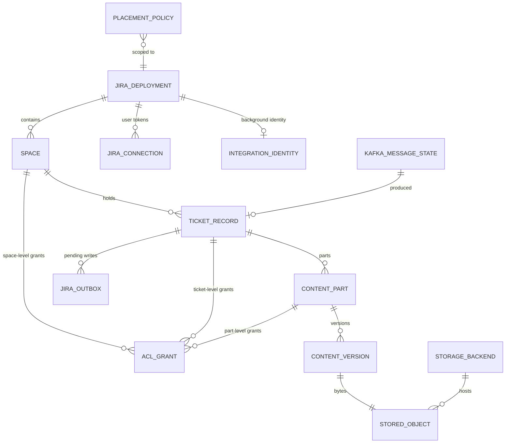
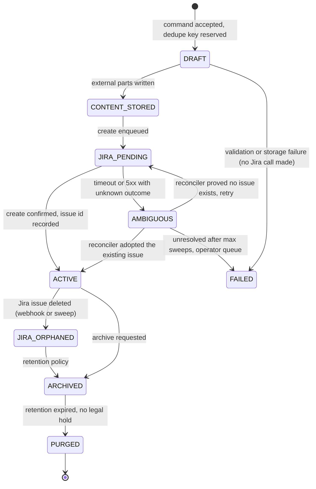

# 4. Data model

PostgreSQL is the single transactional resource. Object storage holds only opaque ciphertext.
Identifiers are UUIDv7 (time-ordered, index-friendly, non-sequential).

## 4.1 Entity relationships



## 4.2 Core tables

```sql
-- A configured Jira target. Cloud sites and DC instances are both deployments.
CREATE TABLE jira_deployment (
  id                 uuid PRIMARY KEY,
  name               text NOT NULL,
  kind               text NOT NULL CHECK (kind IN ('CLOUD','DATA_CENTER')),
  base_url           text NOT NULL,             -- DC base URL, or https://<site>.atlassian.net
  cloud_id           text,                      -- Cloud only; NULL for DC
  oauth_client_id    text NOT NULL,
  oauth_client_secret_ref text NOT NULL,        -- secret-manager reference, never the value
  scopes             text[] NOT NULL,
  api_version        text NOT NULL DEFAULT '3', -- '3' Cloud (ADF), '2' DC (wiki markup)
  parity_default     text NOT NULL DEFAULT 'full',
  created_at         timestamptz NOT NULL DEFAULT now(),
  UNIQUE (kind, base_url)
);

-- Authorization scope for external content. One per (deployment, project) by default.
CREATE TABLE space (
  id                    uuid PRIMARY KEY,
  deployment_id         uuid NOT NULL REFERENCES jira_deployment,
  project_key           text NOT NULL,
  name                  text NOT NULL,
  jira_permission_mode  text NOT NULL DEFAULT 'INTERSECT'
      CHECK (jira_permission_mode IN ('INTERSECT','VAULT_ONLY','JIRA_ONLY','UNION')),
  degraded_grace_seconds integer NOT NULL DEFAULT 0,
  default_classification text NOT NULL DEFAULT 'INTERNAL',
  created_at            timestamptz NOT NULL DEFAULT now(),
  UNIQUE (deployment_id, project_key)
);

-- The binding between a Jira issue and its vault content.
CREATE TABLE ticket_record (
  id                uuid PRIMARY KEY,                 -- ticketRef
  space_id          uuid NOT NULL REFERENCES space,
  issue_type_id     text NOT NULL,
  jira_issue_id     text,                             -- NULL until Jira create succeeds
  jira_issue_key    text,
  state             text NOT NULL CHECK (state IN
                      ('DRAFT','CONTENT_STORED','JIRA_PENDING','AMBIGUOUS',
                       'ACTIVE','JIRA_ORPHANED','ARCHIVED','PURGED','FAILED')),
  origin            text NOT NULL CHECK (origin IN ('UI','API','KAFKA')),
  origin_actor      jsonb,                            -- {type,id,displayName,source} - not a Jira identity
  acting_identity   text NOT NULL,                    -- 'USER:<id>' or 'INTEGRATION:<id>'
  correlation_id    text,
  dedupe_key        text,                             -- business idempotency key
  created_at        timestamptz NOT NULL DEFAULT now(),
  updated_at        timestamptz NOT NULL DEFAULT now(),
  version           bigint NOT NULL DEFAULT 0,        -- optimistic lock
  UNIQUE (space_id, dedupe_key)                       -- the concurrency control for duplicates
);
CREATE UNIQUE INDEX ON ticket_record (jira_issue_id) WHERE jira_issue_id IS NOT NULL;

-- One addressable piece of ticket content.
CREATE TABLE content_part (
  id                uuid PRIMARY KEY,                 -- contentRef; the permanent link identifier
  ticket_id         uuid NOT NULL REFERENCES ticket_record ON DELETE RESTRICT,
  part_type         text NOT NULL CHECK (part_type IN
                      ('SUMMARY','DESCRIPTION','BODY','COMMENT','ATTACHMENT','CUSTOM_FIELD')),
  field_key         text,                             -- 'description', 'customfield_10010', NULL for comments
  section_key       text,                             -- non-NULL only for SPLIT placement
  ordinal           integer NOT NULL DEFAULT 0,
  placement         text NOT NULL CHECK (placement IN ('JIRA','EXTERNAL','SPLIT')),
  classification    text NOT NULL,
  jira_ref          text,                             -- Jira comment id / attachment id when Jira-placed
  jira_surrogate    text,                             -- the placeholder written into Jira
  surrogate_kind    text CHECK (surrogate_kind IN ('PLACEHOLDER','DERIVED_SUMMARY','REDACTED')),
  current_version   uuid,                             -- FK to content_version, set after first write
  display_name_enc  bytea,                            -- original filename, encrypted (it can be sensitive)
  media_type        text,
  legal_hold        boolean NOT NULL DEFAULT false,
  state             text NOT NULL CHECK (state IN
                      ('PENDING_UPLOAD','AVAILABLE','ARCHIVED','SOFT_DELETED','PURGED','QUARANTINED')),
  retention_until   timestamptz,
  created_at        timestamptz NOT NULL DEFAULT now(),
  updated_at        timestamptz NOT NULL DEFAULT now(),
  version           bigint NOT NULL DEFAULT 0
);
CREATE INDEX ON content_part (ticket_id, part_type, ordinal);

CREATE TABLE content_version (
  id                uuid PRIMARY KEY,
  part_id           uuid NOT NULL REFERENCES content_part ON DELETE RESTRICT,
  version_no        integer NOT NULL,
  size_bytes        bigint NOT NULL,
  sha256            bytea NOT NULL,                   -- of PLAINTEXT, computed at ingest
  ciphertext_sha256 bytea NOT NULL,                   -- of stored bytes, for storage-level integrity
  enc_algorithm     text NOT NULL,                    -- e.g. 'AES-256-GCM/FRAMED-1MiB'
  kek_id            text NOT NULL,                    -- KMS key identifier (not the key)
  wrapped_dek       bytea NOT NULL,                   -- DEK wrapped by the KEK
  frame_size        integer,
  storage_object_id uuid NOT NULL REFERENCES stored_object,
  created_by        text NOT NULL,
  created_at        timestamptz NOT NULL DEFAULT now(),
  UNIQUE (part_id, version_no)
);

CREATE TABLE storage_backend (
  id            uuid PRIMARY KEY,
  name          text NOT NULL UNIQUE,
  kind          text NOT NULL CHECK (kind IN ('FILESYSTEM','CMIS','S3','AZURE_BLOB')),
  config        jsonb NOT NULL,                        -- endpoints, bucket/container/root, region
  credential_ref text NOT NULL,                        -- secret-manager reference
  capabilities  jsonb NOT NULL,                        -- discovered at startup, cached
  state         text NOT NULL DEFAULT 'ACTIVE'
                CHECK (state IN ('ACTIVE','READ_ONLY','DRAINING','DISABLED')),
  created_at    timestamptz NOT NULL DEFAULT now()
);

CREATE TABLE stored_object (
  id            uuid PRIMARY KEY,
  backend_id    uuid NOT NULL REFERENCES storage_backend,
  object_key    text NOT NULL,                         -- {tenant}/{contentRef}/{versionId}; no filename
  backend_version_id text,                             -- native version id where the backend has one
  state         text NOT NULL CHECK (state IN ('WRITING','PRESENT','MISSING','DELETED')),
  written_at    timestamptz,
  last_verified_at timestamptz,
  UNIQUE (backend_id, object_key)
);
```

### Notes on the schema

- `content_part.id` **is** the permanent public identifier. Versions, storage objects and even
  backends change beneath it; the link does not (FR-LNK-1).
- `ticket_record.dedupe_key` with a unique constraint is the *only* thing standing between a
  Kafka replay and a duplicate ticket at the moment of creation. It is deliberately in the same
  transaction as the outbox row.
- `display_name_enc` is encrypted because an attachment filename such as
  `2026-Q3-layoffs-final.xlsx` is frequently the most sensitive thing about the file.
- `stored_object` is separate from `content_version` so that migrating an object between
  backends (or having a replica) does not disturb version identity.

## 4.3 Outbox and Jira effects

```sql
CREATE TABLE jira_outbox (
  id             uuid PRIMARY KEY,
  ticket_id      uuid NOT NULL REFERENCES ticket_record,
  deployment_id  uuid NOT NULL REFERENCES jira_deployment,
  issue_lane     text NOT NULL,            -- jira_issue_id, or 'ticket:'||ticket_id before create
  operation      text NOT NULL,            -- CREATE_ISSUE, UPDATE_FIELDS, ADD_COMMENT, EDIT_COMMENT,
                                           -- DELETE_COMMENT, ADD_ATTACHMENT, DELETE_ATTACHMENT,
                                           -- UPSERT_REMOTE_LINK, DELETE_REMOTE_LINK, SET_PROPERTY
  effect_key     text NOT NULL,            -- deterministic; makes replay a no-op
  payload_ref    jsonb NOT NULL,           -- IDENTIFIERS ONLY - never content
  identity_ref   text NOT NULL,            -- 'USER:<id>' or 'INTEGRATION:<id>'
  state          text NOT NULL CHECK (state IN
                   ('PENDING','CLAIMED','IN_FLIGHT','SUCCEEDED','FAILED','ABANDONED')),
  attempts       integer NOT NULL DEFAULT 0,
  next_attempt_at timestamptz NOT NULL DEFAULT now(),
  last_error_code text,                    -- error CLASS, not error text
  created_at     timestamptz NOT NULL DEFAULT now(),
  UNIQUE (ticket_id, effect_key)
);
CREATE INDEX ON jira_outbox (state, next_attempt_at) WHERE state IN ('PENDING','FAILED');
CREATE INDEX ON jira_outbox (issue_lane, state);
```

**`payload_ref` holds identifiers only.** The dispatcher re-reads the actual values from
`content_part` / `content_version` at execution time and runs them through `EgressGuard`. This
is what keeps sensitive content out of a table that gets dumped into support tickets, and it
guarantees the guard runs on the *actual* bytes sent, not on a copy made earlier.

`effect_key` examples: `create-issue`, `remote-link:{contentRef}`,
`comment:{partId}:v{versionNo}`, `attach:{partId}:v{versionNo}`, `prop:jvault.origin`.

## 4.4 Ticket state machine



`FAILED` is never terminal for content: the parts remain and are visible to their owners, so a
user's work is not lost when Jira misbehaves.

## 4.5 Placement policy

```sql
CREATE TABLE placement_policy (
  id             uuid PRIMARY KEY,
  deployment_id  uuid REFERENCES jira_deployment,   -- NULL = all deployments
  project_key    text,                              -- NULL = any project
  issue_type_id  text,                              -- NULL = any issue type
  part_type      text,                              -- NULL = any part type
  field_key      text,                              -- NULL = any field
  specificity    integer NOT NULL,                  -- computed, see 5.2
  placement      text NOT NULL,
  section_rule   jsonb,
  surrogate      jsonb NOT NULL,
  link_placement text[] NOT NULL,
  storage_route  text NOT NULL,
  encryption     jsonb NOT NULL,
  classification text NOT NULL,
  allow_override boolean NOT NULL DEFAULT false,
  enabled        boolean NOT NULL DEFAULT true,
  updated_by     text NOT NULL,
  updated_at     timestamptz NOT NULL DEFAULT now(),
  UNIQUE (deployment_id, project_key, issue_type_id, part_type, field_key)
);
```

The `UNIQUE` constraint over the full selector tuple is what makes FR-CP-2's "no ties" guarantee
structural rather than a validation rule that someone might forget to run.

## 4.6 Authorization

```sql
CREATE TABLE principal (
  id            uuid PRIMARY KEY,
  kind          text NOT NULL CHECK (kind IN ('USER','GROUP','ROLE','SERVICE')),
  external_id   text NOT NULL,     -- IdP subject, group id/name, or service client id
  display_name  text NOT NULL,
  idp_id        text,
  UNIQUE (kind, external_id, idp_id)
);

CREATE TABLE acl_grant (
  id             uuid PRIMARY KEY,
  scope_type     text NOT NULL CHECK (scope_type IN ('SPACE','TICKET','PART')),
  scope_id       uuid NOT NULL,
  principal_id   uuid NOT NULL REFERENCES principal,
  permissions    text[] NOT NULL,   -- subset of VIEW,CREATE,EDIT,DELETE,DOWNLOAD,MANAGE_ACCESS
  can_delegate   boolean NOT NULL DEFAULT false,
  delegation_depth smallint NOT NULL DEFAULT 0,
  granted_by     uuid REFERENCES acl_grant,   -- provenance: revoking a parent revokes children
  granted_by_principal uuid NOT NULL REFERENCES principal,
  expires_at     timestamptz,
  created_at     timestamptz NOT NULL DEFAULT now(),
  UNIQUE (scope_type, scope_id, principal_id)
);
CREATE INDEX ON acl_grant (principal_id);
CREATE INDEX ON acl_grant (granted_by);

CREATE TABLE inheritance_break (
  scope_type text NOT NULL, scope_id uuid NOT NULL,
  PRIMARY KEY (scope_type, scope_id)
);
```

`granted_by` referencing another grant gives cascade revocation for free (FR-AZ-6): revoking a
delegated grant revokes everything granted under its authority, recursively.

## 4.7 Identity and tokens

```sql
CREATE TABLE jira_connection (
  id                 uuid PRIMARY KEY,
  principal_id       uuid NOT NULL REFERENCES principal,
  deployment_id      uuid NOT NULL REFERENCES jira_deployment,
  jira_account_id    text,
  cloud_id           text,
  granted_scopes     text[] NOT NULL,
  access_token_enc   bytea NOT NULL,
  access_expires_at  timestamptz NOT NULL,
  refresh_token_enc  bytea,
  refresh_rotated_at timestamptz,
  token_kek_id       text NOT NULL,
  state              text NOT NULL CHECK (state IN
                      ('ACTIVE','NEEDS_RECONNECT','REVOKED','DISCONNECTED')),
  flow_used          text NOT NULL,   -- 'AUTH_CODE' | 'AUTH_CODE_PKCE'
  connected_at       timestamptz NOT NULL DEFAULT now(),
  last_used_at       timestamptz,
  UNIQUE (principal_id, deployment_id)
);

CREATE TABLE integration_identity (
  id               uuid PRIMARY KEY,
  deployment_id    uuid NOT NULL REFERENCES jira_deployment,
  mechanism        text NOT NULL CHECK (mechanism IN
                    ('CLOUD_SERVICE_ACCOUNT_TOKEN','CLOUD_OAUTH_BOT','CLOUD_APP',
                     'DC_PAT','DC_OAUTH_SERVICE_USER')),
  display_name     text NOT NULL,
  jira_account_id  text,
  credential_ref   text NOT NULL,       -- secret-manager reference
  credential_expires_at timestamptz,
  scopes           text[],
  state            text NOT NULL CHECK (state IN ('ACTIVE','EXPIRING','EXPIRED','REVOKED')),
  last_validated_at timestamptz,
  UNIQUE (deployment_id)
);
```

Jira tokens are encrypted with a **separate key ring** from content (§9.6): compromising the
content KEK must not yield Jira access, and vice versa.

## 4.8 Kafka processing state

```sql
CREATE TABLE kafka_message_state (
  id              uuid PRIMARY KEY,
  topic           text NOT NULL,
  partition       integer NOT NULL,
  kafka_offset    bigint NOT NULL,
  message_key     text,
  dedupe_key      text NOT NULL,
  correlation_id  text NOT NULL,
  mapping_id      uuid NOT NULL REFERENCES kafka_mapping,
  state           text NOT NULL CHECK (state IN
                   ('RECEIVED','VALIDATED','CONTENT_STORED','JIRA_CREATED','LINKED',
                    'COMPLETE','DUPLICATE','RETRYING','DEAD_LETTERED')),
  ticket_id       uuid REFERENCES ticket_record,
  attempts        integer NOT NULL DEFAULT 0,
  last_error_code text,                      -- class only
  quarantine_ref  uuid,                      -- encrypted original payload, when dead-lettered
  received_at     timestamptz NOT NULL DEFAULT now(),
  updated_at      timestamptz NOT NULL DEFAULT now(),
  UNIQUE (topic, partition, kafka_offset),
  UNIQUE (mapping_id, dedupe_key)
);
```

Two unique constraints, two different jobs: `(topic, partition, offset)` catches *redelivery*;
`(mapping_id, dedupe_key)` catches *republication of the same business event on a new offset*.

## 4.9 Audit

```sql
CREATE TABLE audit_event (
  id             uuid PRIMARY KEY,
  occurred_at    timestamptz NOT NULL DEFAULT now(),
  category       text NOT NULL,   -- AUTH, AUTHZ, CONTENT, JIRA, POLICY, ADMIN, KEY
  action         text NOT NULL,
  outcome        text NOT NULL CHECK (outcome IN ('ALLOW','DENY','SUCCESS','FAILURE')),
  actor          jsonb NOT NULL,
  subject        jsonb NOT NULL,  -- identifiers only
  context        jsonb NOT NULL,  -- ip, user agent, correlationId, traceId, decision reason code
  prev_hash      bytea,
  hash           bytea NOT NULL   -- H(prev_hash || canonical(event)) - tamper evidence
) PARTITION BY RANGE (occurred_at);
```

`subject` and `context` are identifier-only by construction; a serialisation test asserts that
no audit event can carry a content-bearing type. Denials are audited as loudly as successes —
a denial stream is the primary detection signal for a link being shared outside its audience.
