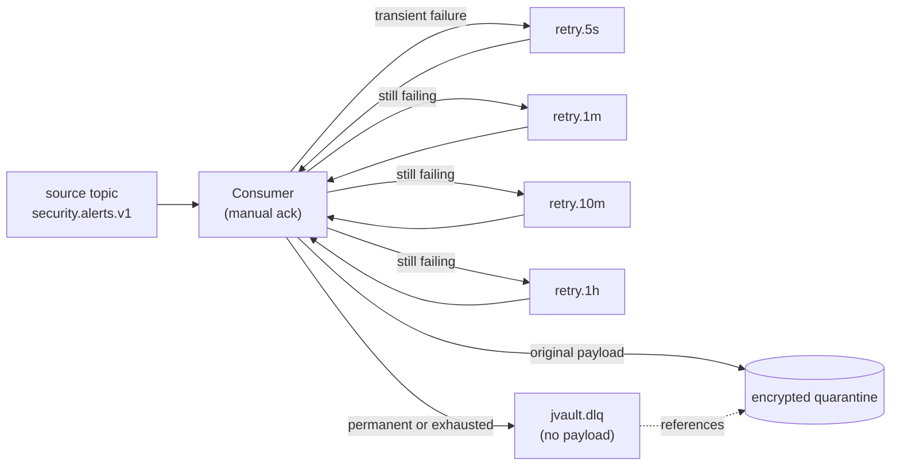
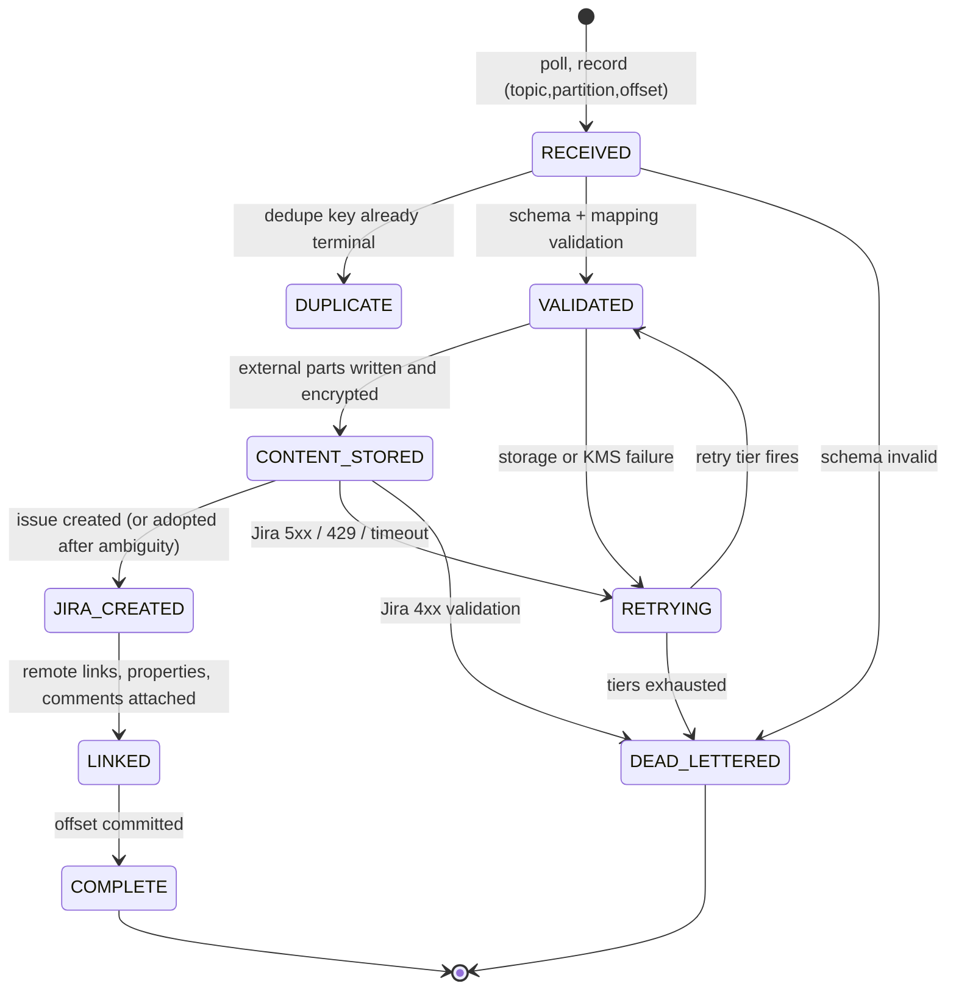

# 7. Kafka integration

## 7.1 Processing guarantees — stated honestly

There is no exactly-once semantics across Kafka, Jira and object storage, and we do not
pretend otherwise. What jvault guarantees:

| Property | Guarantee | Mechanism |
|---|---|---|
| Message delivery | At-least-once | Kafka consumer with manual acknowledgement after state commit |
| Jira ticket creation | **Effectively-once** per business key | `UNIQUE (mapping_id, dedupe_key)` on `kafka_message_state` and `UNIQUE (space_id, dedupe_key)` on `ticket_record` |
| Content storage | Idempotent | Content written to a deterministic key `(contentRef, versionId)`; a retry overwrites identical bytes |
| Link attachment | Idempotent | Remote link `globalId` upsert (§0.6) |
| Ordering | Per partition only | jvault never assumes cross-partition order; producers must key by the entity whose order matters |
| Processing status | Durable and queryable | `kafka_message_state` + `/ingestion/messages/{correlationId}` |

"Effectively-once" means: **at most one Jira issue per business key**, achieved by database
constraints rather than by transactional coordination. In a genuine partition — where jvault
cannot determine whether its `POST /issue` took effect — the system prefers to *pause and
reconcile* rather than to guess, because a duplicate incident ticket is more expensive to clean
up than a delayed one. See [12.4](12-reliability.md).

## 7.2 Consumer topology



**Non-blocking retries.** A failing message moves to a delay-tier topic rather than blocking its
partition. This matters because one poison message against a busy partition would otherwise stall
every other ticket behind it. Consumers of the retry topics apply the tier's delay before
processing (pause-and-resume on the container, not `Thread.sleep`).

**Tier progression** is configurable per mapping; the default `5s → 1m → 10m → 1h` then DLQ suits
Jira's failure modes: rate limits clear in seconds, Jira restarts in minutes, misconfiguration
takes an operator.

**Classification of failures** decides the path:

| Failure | Path |
|---|---|
| Schema validation, mapping error, unknown project/issue type | DLQ immediately — no retry will help |
| Jira 4xx field validation | DLQ immediately, with `fieldErrors` in the record |
| Jira 429 | Retry honouring `Retry-After`; does not consume the error-attempt budget |
| Jira 5xx, timeout, connection failure | Retry tiers |
| Storage or KMS unavailable | Retry tiers; alert after the second tier |
| jvault internal error | Retry once, then DLQ, with an alert |

## 7.3 Mapping configuration

Per-topic configuration binds a schema, a target, and an expression-based field mapping. Full
example in [docs/examples/kafka-mappings.yaml](examples/kafka-mappings.yaml).

```yaml
id: sec-incident-v2
topic: security.alerts.v1
consumerGroup: jvault-sec
schema:
  type: AVRO
  registry: https://schema-registry.internal
  subject: security.alerts.v1-value
  compatibility: BACKWARD
deployment: jira-cloud-prod
target:
  project: SEC
  issueType: Incident
idempotency:
  dedupeKey: ["$.alert.id", "$.alert.revision"]
  window: P7D
actor:
  expr: "$.reporter.email"
  mode: RECORD_ONLY          # RECORD_ONLY | SET_REPORTER_IF_PERMITTED
fields:
  summary:
    expr: "concat('[', $.alert.severity, '] ', $.alert.title)"
    maxLength: 255
    onOverflow: TRUNCATE_ELLIPSIS
  description:
    expr: "$.alert.narrative"
    format: MARKDOWN          # converted to ADF
    placement: EXTERNAL       # subject to policy; see precedence note below
  priority:
    lookup:
      from: "$.alert.severity"
      table: { CRITICAL: "1", HIGH: "2", MEDIUM: "3", LOW: "4" }
      default: "3"
  customfield_10010:
    expr: "$.alert.source.hostname"
    required: true
attachments:
  - forEach: "$.alert.evidence[*]"
    fileName: "$.filename"
    content: { expr: "$.data", encoding: BASE64 }
    mediaType: "$.contentType"
    maxBytes: 52428800
routing:
  onValidationError: DLQ
  onUnmappedRequiredJiraField: DLQ
retries: { tiers: [PT5S, PT1M, PT10M, PT1H] }
```

### Expression language

A restricted JSONPath subset plus a fixed function set (`concat`, `coalesce`, `substring`,
`upper`, `lower`, `format`, `lookup`, `now`, `uuid`, `hash`). No general-purpose scripting: a
mapping is configuration authored by administrators, and an embedded scripting engine would make
configuration a remote-code-execution surface.

### Placement precedence

A mapping may *request* `placement: EXTERNAL`, but the placement policy engine (§5.2) has the
final word, and only in the protective direction:

```
effective = moreProtective( policyResolved , mappingRequested )
```

A mapping can therefore tighten but never loosen. This keeps a single source of truth for
"what may appear in Jira" even though two configuration surfaces can express an opinion.

## 7.4 The processing state machine



The state row is committed **before** the Kafka offset. Redelivery after a crash therefore finds
a state row and resumes from it rather than starting over. The one genuinely hard boundary —
crash between the Jira create request and recording its result — is handled by the ambiguity
protocol, not by this state machine.

### Deduplication, precisely

Two checks, in this order:

1. `SELECT ... FROM kafka_message_state WHERE topic=? AND partition=? AND offset=?`
   → a terminal state means this is a **redelivery**; acknowledge and stop. No Jira call.
2. `INSERT ... ON CONFLICT (mapping_id, dedupe_key) DO NOTHING`
   → no row inserted means this business event was already processed on a **different offset**
   (republication, producer retry, topic replay). Record `DUPLICATE`, link to the existing
   ticket, acknowledge, and stop.

The dedupe window (`idempotency.window`, default 7 days) bounds the state table. Replaying a
topic from the beginning after the window has elapsed **will** create new tickets; that is
stated in the runbook, and the operator-facing replay tool takes an explicit
`--ignore-dedupe-window` flag that requires confirmation.

## 7.5 Security

**Transport and authentication.** TLS 1.2+ with `SASL_SSL`/SCRAM-SHA-512 or mTLS. Credentials
from the secret manager; rotation without restart via a credential-refreshing
`LoginModule`/keystore watcher.

**Authorization (ACLs).** The consumer principal holds:

| Resource | Operation |
|---|---|
| Source topics | `Read` |
| Consumer group | `Read` |
| Retry topics | `Read`, `Write` |
| DLQ topic | `Write` |
| Schema Registry subjects | `Read` |

Explicitly not granted: `Write` on source topics, `Delete`, cluster-level operations, or `Read`
on the DLQ (a separate ops principal reads it). Least privilege here is cheap and worth doing.

**Topic access and retention for sensitive sources.** Covered in
[5.6](05-content-placement.md): restricted ACLs, minimal retention, no payload in retry or DLQ
records, no operator message-browsers pointed at those topics, and a strong preference for
producers to send references rather than payloads.

## 7.6 Identity and attribution

All Kafka-originated Jira operations use the **integration identity** (§10.5). No interactive
session is involved and none is required. The Jira issue's creator is therefore the integration
identity, which is correct — the event, not a person, created it.

The originating actor from the event is recorded separately, in three places:

1. `ticket_record.origin_actor` — the authoritative record.
2. The Jira issue property `jvault.origin` — `{"actor":{...},"channel":"KAFKA","correlationId":"…"}`,
   subject to the 32 KB entity-property limit (§0.9).
3. Optionally a visible Jira custom field (`Originating actor`) or the opening comment, when the
   mapping sets `actor.mode`. Note that the actor's e-mail address may itself be sensitive; the
   default is to record the actor only in jvault and in the property, not in visible Jira text.

`SET_REPORTER_IF_PERMITTED` sets the Jira Reporter to the matching Jira account when the
integration identity holds *Modify Reporter* and the actor resolves to a real Jira user; it
degrades silently to `RECORD_ONLY` otherwise, with a metric so the gap is visible.

## 7.7 Observability

Per-mapping metrics: `jvault_kafka_messages_total{mapping,state}`,
`jvault_kafka_lag_seconds{topic,partition}`, `jvault_kafka_retry_total{mapping,tier}`,
`jvault_kafka_dlq_total{mapping,code}`, `jvault_jira_create_duration_seconds`.

Alerts: DLQ rate above threshold; lag above 5 minutes; any message spending more than one hour
in `RETRYING`; any `AMBIGUOUS` ticket unresolved after two reconciler sweeps; integration
identity credential within 14 days of expiry.

Correlation id (`X-Correlation-Id` header on the message, else generated as a UUIDv7) flows to
logs, traces, the audit trail, the Jira issue property, and the status API — so that a single
identifier answers "what happened to this event" across all five.
