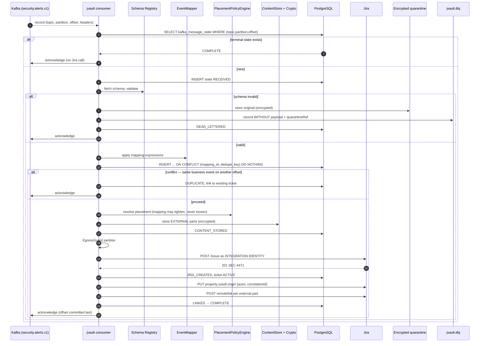
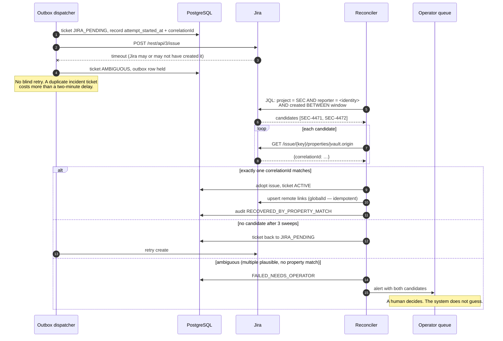

# 14. Sequence diagrams

## 14.1 Ticket creation from the web UI

```mermaid
sequenceDiagram
  autonumber
  actor U as User (browser)
  participant SPA as React SPA
  participant BFF as jvault BFF / API
  participant POL as PlacementPolicyEngine
  participant CS as ContentStore + Crypto
  participant KMS
  participant DB as PostgreSQL
  participant OBX as Outbox dispatcher
  participant J as Jira

  U->>SPA: Choose project + issue type
  SPA->>BFF: GET /meta/projects/{key}/issuetypes/{id}/fields
  BFF->>J: GET createmeta/{project}/issuetypes/{id} (as the user)
  J-->>BFF: field metadata
  BFF->>POL: resolve placement per field
  POL-->>BFF: placement annotations
  BFF-->>SPA: fields + placement + layout
  Note over SPA: Fields that will be stored externally<br/>are labelled before the user types

  U->>SPA: Fill form, attach evidence.pcap
  SPA->>BFF: POST /uploads → PUT chunks → POST complete
  BFF->>KMS: GenerateDataKey(keyRing)
  KMS-->>BFF: plaintext DEK + wrapped DEK
  BFF->>CS: put(encrypted stream)
  CS-->>BFF: storedObjectRef
  BFF->>DB: content_part(PENDING_UPLOAD) → AVAILABLE, content_version

  U->>SPA: Submit
  SPA->>BFF: POST /tickets (Idempotency-Key)
  BFF->>POL: resolve PlacementPlan
  BFF->>DB: BEGIN; ticket_record(DRAFT) + dedupe key + parts + outbox(CREATE_ISSUE); COMMIT
  Note over DB: UNIQUE(space_id, dedupe_key) is the<br/>concurrency control against duplicates
  BFF-->>SPA: 202 Accepted + status link

  OBX->>DB: claim outbox row (FOR UPDATE SKIP LOCKED), lane = ticket
  OBX->>OBX: EgressGuard.sanitise → JiraSafePayload
  Note over OBX: Hash check vs EXTERNAL parts,<br/>classifier, fail closed
  OBX->>J: POST /rest/api/3/issue (surrogates only)
  J-->>OBX: 201 SEC-4471
  OBX->>DB: ticket ACTIVE, issue id/key recorded
  OBX->>J: PUT /issue/SEC-4471/properties/jvault.origin
  OBX->>J: POST /issue/SEC-4471/remotelink (globalId=jvault:content:…)
  J-->>OBX: 201 (upsert — safe to repeat)
  OBX->>DB: outbox rows SUCCEEDED; audit

  SPA->>BFF: GET /tickets/{ref}/status (poll)
  BFF-->>SPA: ACTIVE, issueKey SEC-4471
  SPA-->>U: Ticket created, with the Jira link
```

## 14.2 Ticket creation via REST (service client)

```mermaid
sequenceDiagram
  autonumber
  participant C as API client
  participant IDP as Enterprise IdP
  participant API as jvault REST API
  participant POL as PlacementPolicyEngine
  participant CS as ContentStore + Crypto
  participant DB as PostgreSQL
  participant OBX as Outbox dispatcher
  participant J as Jira

  C->>IDP: client_credentials (private_key_jwt)
  IDP-->>C: access token
  C->>API: POST /api/v1/tickets<br/>Authorization: Bearer …<br/>Idempotency-Key: 7f3a…
  API->>API: Validate token (iss, aud, sig, exp) → SERVICE principal
  API->>DB: idempotency lookup by key + fingerprint
  alt key already completed
    DB-->>API: stored response
    API-->>C: 200 + Idempotency-Replayed: true
  else new request
    API->>POL: resolve PlacementPlan
    API->>API: validate against cached createmeta
    API->>CS: store EXTERNAL parts (encrypted)
    API->>DB: BEGIN; ticket + parts + outbox; store idempotency record; COMMIT
    API-->>C: 202 Accepted + Location: /tickets/{ref}
    OBX->>J: create issue, set properties, upsert remote links
    OBX->>DB: ACTIVE
    C->>API: GET /tickets/{ref}
    API-->>C: 200 ticket with issueKey
  end
```

Note the service client never carries a Jira identity: REST-originated work that has no
interactive user runs under the integration identity, exactly like Kafka-originated work.

## 14.3 Ticket creation from a Kafka event



The offset is committed **last**, after the state row is terminal. Everything before that point is
replayable; everything after it is already recorded.

## 14.4 Application login (OIDC)

```mermaid
sequenceDiagram
  autonumber
  actor U as User
  participant B as Browser / SPA
  participant BFF as jvault BFF
  participant IDP as Entra ID / Keycloak

  U->>B: Open jvault
  B->>BFF: GET /
  BFF-->>B: 302 → IdP authorize<br/>(code, PKCE S256, state, nonce, scope=openid profile groups)
  B->>IDP: authorize
  IDP->>U: Authenticate (+ MFA, conditional access)
  U-->>IDP: credentials
  IDP-->>B: 302 → /login/oauth2/code/idp?code&state
  B->>BFF: callback
  BFF->>BFF: verify state; nonce pinned for the id_token check
  BFF->>IDP: POST /token (code + code_verifier + client auth)
  IDP-->>BFF: id_token, access_token, refresh_token
  BFF->>IDP: JWKS (cached) → verify signature, iss, aud, exp, nonce
  BFF->>BFF: map group/role claims → jvault roles
  BFF-->>B: Set-Cookie: __Host-JVAULT_SESSION (HttpOnly, Secure, SameSite=Lax)<br/>302 → app
  Note over B,BFF: Tokens stay server-side.<br/>The SPA holds a session cookie and nothing else.
  B->>BFF: GET /api/v1/me
  BFF-->>B: profile, roles, Jira connection state
```

## 14.5 Connecting Jira (OAuth authorization code)

```mermaid
sequenceDiagram
  autonumber
  actor U as User
  participant B as Browser
  participant BFF as jvault BFF
  participant DB as PostgreSQL
  participant A as Atlassian (Cloud) / Jira (DC)
  participant SM as Secret manager

  U->>B: Click "Connect Jira"
  B->>BFF: POST /api/v1/jira/connections/start
  BFF->>DB: store state {stateId, sessionId, userId, deploymentId, codeVerifier?, redirectUri, TTL 10m, singleUse}
  BFF-->>B: { authorizationUrl }
  B->>A: GET authorize?client_id&scope&redirect_uri&state&response_type=code<br/>(Cloud: audience=api.atlassian.com, prompt=consent · DC: + code_challenge S256)
  A->>U: Authenticate and approve scopes
  U-->>A: Approve
  A-->>B: 302 redirect_uri?code=…&state=…
  B->>BFF: GET /api/v1/jira/connections/callback
  BFF->>DB: load state; assert unused, unexpired, bound to THIS session
  BFF->>SM: fetch client secret
  BFF->>A: POST /oauth/token (code, client_id, client_secret[, code_verifier])
  A-->>BFF: access_token, refresh_token, expires_in
  BFF->>DB: mark state used (single-use)

  alt Jira Cloud
    BFF->>A: GET /oauth/token/accessible-resources
    A-->>BFF: [ {id: cloudid, name, scopes}, … ]
    alt more than one site
      BFF-->>B: site selection
      U->>B: pick site
      B->>BFF: POST /jira/connections/{id}/site {cloudId}
    end
  end

  BFF->>BFF: encrypt tokens (jira-tokens key ring)
  BFF->>DB: jira_connection ACTIVE {scopes, cloudId, flow_used}
  BFF-->>B: 302 back to where the user was
  Note over U,B: No token was ever shown, copied or pasted.
```

## 14.6 Token renewal (single-flight, rotating refresh token)

```mermaid
sequenceDiagram
  autonumber
  participant R1 as Request A
  participant R2 as Request B
  participant TS as JiraTokenService
  participant DB as PostgreSQL
  participant A as Atlassian

  R1->>TS: getAccessToken(user, deployment)
  R2->>TS: getAccessToken(user, deployment)
  TS->>DB: read connection (both)
  Note over TS: access token expired or within 20% of expiry
  TS->>DB: pg_try_advisory_xact_lock(hash(connectionId))
  DB-->>TS: A acquires, B blocks
  TS->>A: POST /oauth/token grant_type=refresh_token
  A-->>TS: new access_token + NEW refresh_token (old one now invalid)
  TS->>DB: UPDATE connection SET both tokens, expiry; COMMIT (lock released)
  TS-->>R1: access token
  DB-->>TS: B proceeds, re-reads, finds a fresh token
  TS-->>R2: same access token (no second refresh call)

  alt refresh rejected (revoked / inactive > 90d / consent withdrawn)
    A-->>TS: 400 invalid_grant
    TS->>DB: state = NEEDS_RECONNECT, clear tokens
    TS-->>R1: 409 jira-reconnect-required + connectUrl
    Note over TS: No retry loop — repeated use of an invalidated<br/>rotating token looks like token theft.
  end
```

## 14.7 Accessing protected content through a Jira link

```mermaid
sequenceDiagram
  autonumber
  actor U as User
  participant JIRA as Jira issue (placeholder + remote link)
  participant B as Browser
  participant BFF as jvault
  participant AZ as ContentAuthorizationService
  participant DB as PostgreSQL
  participant J as Jira API
  participant CS as ContentStore
  participant KMS

  U->>JIRA: Open SEC-4471, click the jvault link
  B->>BFF: GET /c/01J8ZQ… (the stable endpoint)
  alt no session
    BFF-->>B: 302 → OIDC login, then return here
  end
  BFF->>DB: resolve contentRef → part, ticket, space, state
  BFF->>AZ: authorize(principal, part, DOWNLOAD)
  AZ->>DB: walk space→ticket→part grants for user+groups+roles
  AZ->>AZ: space mode = INTERSECT
  AZ->>J: GET /issue/{id}?fields=id AS THE USER (60 s cached)
  alt Jira says no
    J-->>AZ: 403/404
    AZ-->>BFF: DENY (reason: JIRA_NO_BROWSE)
    BFF->>DB: audit AUTHZ/DENY
    BFF-->>B: 403 — possession of the link granted nothing
  else Jira says yes and a vault grant exists
    J-->>AZ: 200
    AZ-->>BFF: ALLOW (VIEW, DOWNLOAD)
    BFF->>DB: read content_version (wrapped DEK, kek id, digests)
    BFF->>KMS: Decrypt(wrapped DEK)
    KMS-->>BFF: plaintext DEK
    BFF->>CS: open(objectRef, range)
    CS-->>BFF: ciphertext frames
    BFF->>BFF: decrypt + verify tag per frame; verify SHA-256 at end
    BFF-->>B: 200 stream (Cache-Control: no-store)
    BFF->>DB: audit CONTENT/SUCCESS {contentRef, version, bytes, actor}
  end
  Note over B,BFF: No storage URL, no presigned link, no bucket name<br/>ever reaches the browser. Each range request re-authorizes.
```

## 14.8 Recovery: Jira create succeeded but the response was lost


